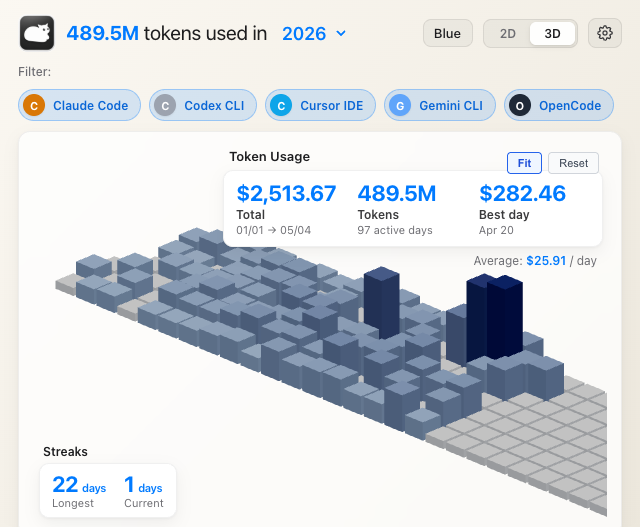
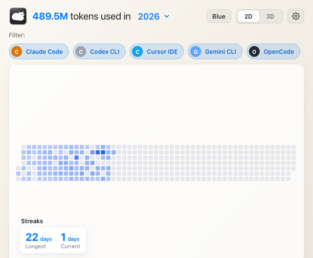
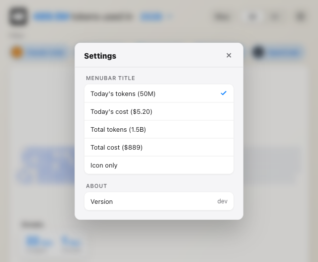
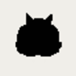

<h1 align="center">Tokcat</h1>

<p align="center">
  <strong>Your AI token usage, alive in the macOS menu bar.</strong>
</p>

<p align="center">
  <a href="README.md">English</a> |
  <a href="README.ko-KR.md">한국어</a>
</p>

<p align="center">
  <a href="https://github.com/handlecusion/tokcat/releases/latest"></a>
  <a href="https://github.com/handlecusion/tokcat/stargazers"></a>
  <a href="https://opensource.org/licenses/MIT"></a>
  
  
  
</p>

<br>

You spent **$2,513.67** on AI coding tools in the last four months. You don't know that, because you can't see it.

Tokcat is a native macOS menubar app that turns the [`tokscale`](https://github.com/junhoyeo/tokscale) CLI into a live, glanceable dashboard. The cat icon sits in your menu bar showing today's tokens or cost; click it and a frosted glass popover opens with a 2D / 3D contribution graph of every Claude Code, Codex, Cursor, OpenCode, Gemini, and Copilot session you've ever run.

<p align="center">
  
</p>

---

## Quick Start

```sh
brew tap handlecusion/tokcat
brew install --cask tokcat
```

That's it. The cask pulls in the `tokscale` formula automatically, so the CLI Tokcat depends on is installed in the same step. Open **Tokcat** from `/Applications` — the cat shows up in the menu bar, the Dock stays clean, and clicking the icon opens the dashboard.

The in-app updater checks for new releases on launch and again every 30 minutes; signed `.tar.gz` artifacts are verified against the embedded public key before install.

> Prefer a one-off DMG? Grab `Tokcat_<version>_aarch64.dmg` from
> [Releases](https://github.com/handlecusion/tokcat/releases). You'll need to
> install `tokscale` separately:
> `brew install junhoyeo/tokscale/tokscale`. Tokcat detects a missing or
> outdated CLI on first launch and walks you through it.

---

## Why Tokcat

| | |
|---|---|
| **Glanceable** | The menu bar title is configurable: today's tokens, today's cost, total tokens, total cost, or icon-only. |
| **Native** | Tauri 2 shell with macOS `NSVisualEffectView` vibrancy, system fonts, and `prefers-color-scheme` light/dark adaptation. |
| **Quiet** | Lives in the menu bar — no Dock icon, no spurious notifications, auto-hides when you click another app. |
| **Honest** | Numbers come from `tokscale` reading your local session logs. No telemetry, no cloud sync, no account required. |
| **Multi-client** | Whatever `tokscale` supports, Tokcat shows: Claude Code, Codex, Cursor, OpenCode, Gemini, Copilot, Amp, Droid, and more. |
| **Cat** | Optional spinning cat tray animation that picks up speed as your token velocity rises. |

---

## How It Works

Tokcat is a thin Tauri wrapper around the `tokscale` CLI. On a 3-minute interval (and on demand from the tray menu), the app shells out to:

```sh
tokscale graph --no-spinner [--year YYYY]
```

The JSON output is cached in memory and pushed to the React frontend, which renders it as a 2D heatmap or a 3D tile graph powered by react-three-fiber. Per-client filters, summary cards, and the menu bar title all update from the same payload.

### 2D heatmap

GitHub-style contribution grid. Click and hold for a date / cost / token tooltip.

<p align="center">
  
</p>

### 3D tile graph

Orthographic isometric projection with orbit controls and persistent camera state. The default framing auto-fits to the active tile cluster so populated days stay readable instead of getting lost in the empty future.

<p align="center">
  
</p>

### Menubar settings

A native System Settings-styled panel for the menu-bar title, animated tray icon, launch-at-login, and one-click update check.

<p align="center">
  
</p>

### Animated tray icon

When animation is on, the menubar cat picks up speed as your token velocity rises — a quiet visual cue that you're shipping (or burning).

<p align="center">
  
</p>

---

## Features

| Feature | Details |
|---------|---------|
| **2D / 3D contribution graph** | GitHub-style heatmap or interactive 3D tile graph with orbit controls, persistent camera, and auto-fit-to-active-tiles framing. |
| **Per-client filters** | Toggle Claude Code, Codex, Cursor, OpenCode, Gemini, Copilot, etc. — driven by whatever `tokscale` discovers locally. |
| **Live menu-bar title** | Today's tokens, today's cost, total tokens, total cost, or icon-only. Updates every 3 minutes. |
| **Animated tray icon** | Optional cat (or wireframe cube) animation whose FPS scales with your real-time token velocity. |
| **Native vibrancy + glassmorphism** | Transparent window with macOS `sidebar` `NSVisualEffectView`; light/dark auto via `prefers-color-scheme`. |
| **Menubar popover behavior** | Chromeless window, drag region on the header, auto-hides when focus leaves the app. |
| **Settings panel** | macOS System Settings-styled preferences with switch toggles, sectioned groups, version info, and one-click update check. |
| **First-run onboarding** | If `tokscale` is missing or outdated, a friendly dialog explains how to install or upgrade with one command. |
| **In-app updater** | Signed releases via Tauri updater. Silent check on launch and every 30 minutes; manual check from Settings or the tray menu. |
| **Launch at login** | Tauri autostart plugin — opt-in via Settings. |
| **Streaks & summaries** | Longest / current streak, total tokens, total cost, daily average, best day. |
| **No telemetry** | Tokcat never makes a network request except the updater manifest. All data stays local. |

---

## Usage

After installation, launch **Tokcat** from `/Applications`. Click the cat in the menu bar to open the dashboard. Right-click for the tray menu (Open, Settings…, Refresh Now, About, Check for Updates, Quit).

<details>
<summary><strong>Keyboard & menu shortcuts</strong></summary>
<br>

| Action | Shortcut |
|---|---|
| Open Settings | <kbd>⌘</kbd>,  (from tray menu) |
| Refresh now (bypass 3-min cache) | <kbd>⌘</kbd>R (from tray menu) |
| Quit Tokcat | <kbd>⌘</kbd>Q (from tray menu) |

</details>

<details>
<summary><strong>Settings</strong></summary>
<br>

| Setting | Effect |
|---|---|
| Menubar title | What the menu-bar text shows next to the icon. |
| Launch at login | Starts Tokcat automatically when you log in (Tauri autostart). |
| Animate tray icon | Cat or wireframe-cube animation that reflects token velocity. |
| About → Version | Currently installed Tokcat version. |
| About → Check Now | Same as the tray menu's "Check for Updates…", but in-pane. |
| Quit Tokcat | Exits the app. |

</details>

<details>
<summary><strong>Troubleshooting</strong></summary>
<br>

**Dashboard shows `tokscale CLI not found` or `env: node: No such file or directory`**

Tokcat shells out to `tokscale`, which is itself a Node-based CLI. Make sure both are installed and on your `PATH`:

```sh
which tokscale          # /opt/homebrew/bin/tokscale
which node              # /opt/homebrew/bin/node
tokscale graph --no-spinner | head -20
```

If `tokscale` works in Terminal but Tokcat still complains, you're running an old build that doesn't ship the `LaunchServices` PATH augmentation. Update via Settings → About → Check Now, or `brew upgrade --cask tokcat`.

**The menu-bar window vanishes when I click anywhere**

That's intentional — Tokcat behaves like a native menubar popover. To keep it visible while interacting with another app, drag the window away from the menu bar by its header (anywhere outside the controls is a drag region).

**`brew install --cask tokcat` says no formula found**

Re-tap the source: `brew tap handlecusion/tokcat && brew update`.

</details>

---

## Build From Source

```sh
git clone https://github.com/handlecusion/tokcat.git
cd tokcat
pnpm install            # or: npm install
pnpm tauri:dev          # opens the menubar app with Vite HMR on :4061
pnpm tauri:build        # production .app + .dmg in src-tauri/target/release/bundle
```

The `dev` script runs the web frontend in a browser at `http://localhost:4061` against a small Express + Vite server (`server.js`) that proxies `tokscale graph` — useful for iterating on the UI without rebuilding the Tauri shell.

<details>
<summary><strong>Releasing a new version</strong></summary>
<br>

```sh
# 1. bump version in package.json, src-tauri/tauri.conf.json, src-tauri/Cargo.toml
# 2. cargo check (refreshes Cargo.lock)
# 3. commit, push to origin/main
scripts/release.sh <version> "<release notes>"
```

`scripts/release.sh` builds the production app and DMG, strips the embedded `.VolumeIcon.icns` (which would otherwise show up in Finder when hidden files are visible), generates the updater signature, writes `latest.json`, tags the release, and uploads everything via `gh release create`.

After the release lands, bump `Casks/tokcat.rb` in [`handlecusion/homebrew-tokcat`](https://github.com/handlecusion/homebrew-tokcat) so brew users see the new version.

</details>

---

## Repos involved

| Repo | Role |
|---|---|
| [`handlecusion/tokcat`](https://github.com/handlecusion/tokcat) | App source, GitHub Releases, in-app updater manifest |
| [`handlecusion/homebrew-tokcat`](https://github.com/handlecusion/homebrew-tokcat) | Homebrew tap (`Casks/tokcat.rb`) — what `brew install --cask tokcat` resolves |
| [`junhoyeo/tokscale`](https://github.com/junhoyeo/tokscale) | The upstream CLI Tokcat depends on for all data |

---

## Acknowledgements

Tokcat is built on top of the [`tokscale`](https://github.com/junhoyeo/tokscale) CLI. Special thanks to [@junhoyeo](https://github.com/junhoyeo) for creating and maintaining `tokscale` — Tokcat would not exist without it.

---

## Licence

MIT. See [LICENSE](LICENSE).

<p align="center">
<br>
<code>brew tap handlecusion/tokcat &amp;&amp; brew install --cask tokcat</code><br>
<sub>macOS 11+ · Apple Silicon · Tauri 2 · React / Vite · MIT</sub>
</p>
